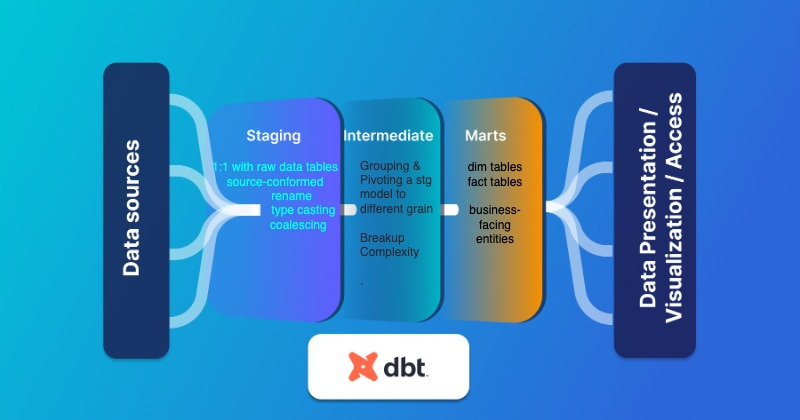
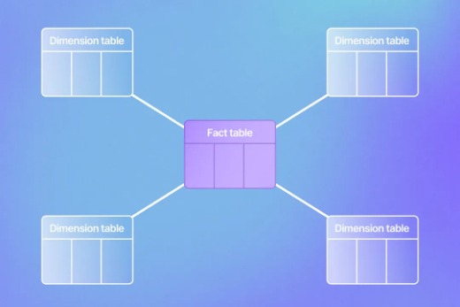

# DBT Snowflake Coding Conventions and Style Guide

# Models Structure


The file and naming structures are as follows:

```shell

├── README.md
├── analyses
├── seeds
├── dbt_project.yml
├── macros
│   └── cents_to_dollars.sql
├── models
│   ├── intermediate
│   │   └── cms_hcc
│   │       ├── cms_hcc__models.yml
│   │       └── int_patient_risk_joined.sql
│   ├── marts
│   │   ├── risk_assessment
│   │   │   ├── risk_assessment__models.yml
│   │   │   ├── patient_risk_scores.sql
│   ├── sources
│   │   ├── cms_hcc
│   │   │   ├── cms_hcc__source.yml
│   ├── staging
│   │   ├── cms_hcc
│   │   │   ├── cms_hcc__docs.md
│   │   │   ├── cms_hcc__models.yml
│   │   │   ├── stg_cms_hcc__patient_risk_factors.sql
│   │   │   └── stg_cms_hcc__patient_risk_scores.sql
│   └── utilities
│       └── all_dates.sql
├── packages.yml
├── snapshots
└── tests
    └── assert_positive_value_for_total_amount.sql
```


Models can fit into four categories:



**Sources**: 
- refer to the raw table data that have been built in the warehouse through a loading process or data that is ingested directly from an external source into the data warehouse.
Schemas and tables in a source-conformed structure (i.e. tables and columns in a structure based on what an API returns), loaded by a third party tool.

**Staging models**: 
- refers to models that are built directly on top of sources. These have a **one-to-one** relationship with sources tables. These are used for very light transformations that shape the data into what you want it to be. These models are used to clean and standardize the data before transforming data downstream. 

    - **Subdirectories based on the source system**. 
    - File names: `stg_[source]__[entity]s.sql the double underscore between source system and entity helps visually distinguish the separate parts in the case of a source name having multiple words
    - All objects should be plural e.g: `stg_cms_hcc__demographic_factors`
    - Most standard types of staging model transformations (rename/alias, type casting, basic computation, Categorizing)
    - **materialized as views**
        - Any downstream model (discussed more in marts) referencing our staging models will always get the freshest data possible from all of the component views it’s pulling together and materializing
        - It avoids wasting space in the warehouse on models that are not intended to be queried by data consumers, and thus do not need to perform as quickly or efficiently
        - Staging models are the only place we'll use the source macro, and our staging models should have a 1-to-1 relationship to our source tables. That means for each source system table we’ll have a single staging model referencing it, acting as its entry point — staging it — for use downstream.
            - no join, no Aggregations 

**Intermediate models**: 
- This layer consists of models between the staging layer and the marts layer. These models are built on top of our staging models and are used to conduct extensive data transformations, as well as data consolidation from multiple sources. These models should be built on staging models rather than directly on sources to leverage the data cleaning that was done in staging.
    - **Subdirectories based on business groupings**
    - File names: `int_[entity]s_[verb]s.sql`
    - **No** Exposed to end users.
    - **materialized as views**

**Mart models**: `[entity]s.sql`
- This directory often contains the business-facing models, which are curated datasets ready for analysis. They are typically built on top of the Intermediate, dimension, and fact models and are structured according to the business’s analytical needs
Note: These are typically **materialized as table**.
- **Dimension tables** `dim_[noun]`
are used to represent contextual or descriptive information for a business process event. Dimensions are used to add context to facts by describing the who, what, when, where, and why. They are mutable, though slowly changing
    - Provide context to facts
    - Contain descriptive attributes
    - Enable filtering and grouping during analysis

- **Fact tables** `fct_[verb]` 
capture the metrics and measurements resulting from business processes. These models are central to the star schema, surrounded by dimensions. A tall, narrow table representing real-world processes that have occurred or are occurring. The heart of these models is usually an immutable event stream
    - Store quantitative data
    - Typically contain numeric values
    - Often have foreign keys to dimension tables
    - Granularity: Ensure that the fact table's granularity aligns with the level of detail required for analysis.
    - Indexes: Use indexes to optimize query performance, especially for large fact tables.
    - Immutability: Treat fact tables as append-only to maintain a historical record of events.
    - Testing: Implement data quality tests to ensure the accuracy and integrity of the fact table.



## Naming and field conventions


* folder and file_name should be in `snake_case` 
* All objects should be plural e.g: `patients`
* Base tables are prefixed with `base__`, such as: `base__<source>_<object>`
* Intermediate tables should end with a past tense verb indicating the action performed on the object, such as: `int_patients_unioned`
* Marts are categorized between fact (immutable, verbs) and dimensions (mutable, nouns) with a prefix that indicates either, such as: `fct_[verb]` or `dim_[noun]`

* Schema, table and column names should be in `snake_case`.
* Use names based on the _business_ terminology, rather than the source terminology.
* Each model should have a primary key.
* The primary key of a model should be named `<object>_id`, e.g. `account_id` – this makes it easier to know what `id` is being referenced in downstream joined models.
* Keys should be string data types.
* For base/staging models, fields should be ordered in categories, where identifiers are first and timestamps are at the end.
* Timestamp columns should be named `<event>_at`, e.g. `created_at`, and should be in UTC. If a different timezone is being used, this should be indicated with a suffix, e.g `created_at_pt`.
* Dates should be named <event>_date 
* Events dates and times should be past tense — created , updated , or deleted
* Booleans should be prefixed with `is_` or `has_`.
* Price/revenue fields should be in decimal currency (e.g. `19.99` for $19.99; many app databases store prices as integers in cents). If non-decimal currency is used, indicate this with suffix, e.g. `price_in_cents`.
* Avoid reserved words as column names
* Consistency is key! Use the same field names across models where possible, e.g. a key to the `customers` table should be named `customer_id` rather than `user_id`.


## DBT Dimensional Transformations
Dimensional transformations in dbt involve organizing data into facts and dimensions, which are essential for creating a structured and accessible data warehouse. Facts represent quantitative data, while dimensions provide context and are typically textual or descriptive attributes.

### Fact Tables
- Store quantitative data
- Typically contain numeric values
- Often have foreign keys to dimension tables

### Dimension Tables
- Provide context to facts
- Contain descriptive attributes
- Enable filtering and grouping during analysis

By separating data into facts and dimensions, dbt allows for efficient storage and powerful analysis. This separation also aids in the creation of a semantic layer, which simplifies data access and enhances the efficiency of data analysis.

### Example a source yaml
Sources are defined in .yml files nested under a sources
- file name: `[source]__sources.yml` eg: cms_hcc__source.yml

```
version: 2

sources:
  - name: cms_hcc__source
    database: raw
    schema:  cms_hcc
    tables:
      - name: patient_risk_factors
        columns:
          - name: id
            description: Primary key of the patient_risk_factors table
            tests:
              - unique
              - not_null
          - name: status
            description: Note that the status can change over time

```

### Example model in staging

cms_hcc__models.sql

```
version: 2

models:
  - name: stg_cms_hcc__patient_risk_factors
    config:
      schema: cms_hcc
      alias: patient_risk_factors
      tags: cms_hcc
      materialized: view
    description: >
      This final model displays the contributing demographic and disease risk 
      factors, interactions, and HCCs for each enrollee in the payment year.
    columns:
      - name: patient_id
        description: Unique ID for the patient.
      - name: enrollment_status_default
        description: >
          Indicates the input data was missing and a default status was used.

  - name: stg_cms_hcc__patient_risk_scores
    config:
      schema: cms_hcc
      alias: patient_risk_scores
      tags: cms_hcc
      materialized: view
    description: >
      This final model calculates the CMS HCC raw risk score, blended risk score,
      normalized risk score, and payment risk score for each enrollee in the 
      payment year.
    columns:
      - name: patient_id
        description: Unique ID for the patient.
        tests:
          - unique
      - name: v24_risk_score
        description: >
          The sum of all patient risk factors from model version CMS-HCC-V24. 
          If payment year >= 2024 then the score may be weighted following 
          CMS's transition plan.
      - name: v28_risk_score
        description: >
          The sum of all patient risk factors from model version CMS-HCC-V28.
          If payment year >= 2024 then the score may be weighted following 
          CMS's transition plan.

```

### Example `stg_cms_hcc__patient_risk_scores.sql` and `stg_cms_hcc__patient_risk_factors` staging models


```
select
    id::varchar as patient_id,
    v24_risk_score,
    v28_risk_score
from {{source('cms_hcc_source','patient_risk_factors')}}

```

### Example `int_patient_risk_joined.sql`  model


```
with patient_risk_score as (
    select * from {{ ref('stg_cms_hcc__patient_risk_scores') }}
),
patient_risk_factors as (

    select * from {{ ref('stg_cms_hcc__patient_risk_factors')}}
)
select 
    patient_risk_score.*, patient_risk_factors.status
from 
    patient_risk_score inner join patient_risk_factors on
    patient_risk_score.patient_id = patient_risk_factors.patient_id


```


## Model configuration

- Model-specific attributes (like sort/dist keys) should be specified in the model.
- If a particular configuration applies to all models in a directory, it should be specified in the `dbt_project.yml` file.
- In-model configurations should be specified like this:

```python
{{
  config(
    materialized = 'table',
    sort = 'id',
    dist = 'id'
  )
}}
```
- Marts should always be configured as tables

## dbt conventions
* Only `stg_` models (or `base_` models if your project requires them) should select from `source`s.
* All other models should only select from other models.

## Testing

- Every subdirectory should contain a `.yml` file, in which each model in the subdirectory is tested. For staging folders, the naming structure should be `src_sourcename.yml`. For other folders, the structure should be `foldername.yml` (example `core.yml`).
- At a minimum, unique and not_null tests should be applied to the primary key of each model.


## CTEs

For more information about why we use so many CTEs, check out [this discourse post](https://discourse.getdbt.com/t/why-the-fishtown-sql-style-guide-uses-so-many-ctes/1091).

- All `{{ ref('...') }}` statements should be placed in CTEs at the top of the file
- Where performance permits, CTEs should perform a single, logical unit of work.
- CTE names should be as verbose as needed to convey what they do
- CTEs with confusing or noteable logic should be commented
- CTEs that are duplicated across models should be pulled out into their own models
- create a `final` or similar CTE that you select from as your last line of code. This makes it easier to debug code within a model (without having to comment out code!)
- CTEs should be formatted like this:

``` sql
with

events as (

    ...

),

-- CTE comments go here
filtered_events as (

    ...

)

select * from filtered_events
```

## SQL style guide

- Use trailing commas
- Indents should be four spaces (except for predicates, which should line up with the `where` keyword)
- Lines of SQL should be no longer than 80 characters
- Field names and function names should all be lowercase
- The `as` keyword should be used when aliasing a field or table
- Fields should be stated before aggregates / window functions
- Aggregations should be executed as early as possible before joining to another table.
- Ordering and grouping by a number (eg. group by 1, 2) is preferred over listing the column names (see [this rant](https://blog.getdbt.com/write-better-sql-a-defense-of-group-by-1/) for why). Note that if you are grouping by more than a few columns, it may be worth revisiting your model design.
- Prefer `union all` to `union` [*](http://docs.aws.amazon.com/redshift/latest/dg/c_example_unionall_query.html)
- Avoid table aliases in join conditions (especially initialisms) – it's harder to understand what the table called "c" is compared to "customers".
- If joining two or more tables, _always_ prefix your column names with the table alias. If only selecting from one table, prefixes are not needed.
- Be explicit about your join (i.e. write `inner join` instead of `join`). `left joins` are normally the most useful, `right joins` often indicate that you should change which table you select `from` and which one you `join` to.

- *DO NOT OPTIMIZE FOR A SMALLER NUMBER OF LINES OF CODE. NEWLINES ARE CHEAP, BRAIN TIME IS EXPENSIVE*

### Example SQL
```sql
with

my_data as (

    select * from {{ ref('my_data') }}

),

some_cte as (

    select * from {{ ref('some_cte') }}

),

some_cte_agg as (

    select
        id,
        sum(field_4) as total_field_4,
        max(field_5) as max_field_5

    from some_cte
    group by 1

),

final as (

    select [distinct]
        my_data.field_1,
        my_data.field_2,
        my_data.field_3,

        -- use line breaks to visually separate calculations into blocks
        case
            when my_data.cancellation_date is null
                and my_data.expiration_date is not null
                then expiration_date
            when my_data.cancellation_date is null
                then my_data.start_date + 7
            else my_data.cancellation_date
        end as cancellation_date,

        some_cte_agg.total_field_4,
        some_cte_agg.max_field_5

    from my_data
    left join some_cte_agg  
        on my_data.id = some_cte_agg.id
    where my_data.field_1 = 'abc'
        and (
            my_data.field_2 = 'def' or
            my_data.field_2 = 'ghi'
        )
    having count(*) > 1

)

select * from final

```

- Your join should list the "left" table first (i.e. the table you are selecting `from`):
```sql
select
    trips.*,
    drivers.rating as driver_rating,
    riders.rating as rider_rating

from trips
left join users as drivers
    on trips.driver_id = drivers.user_id
left join users as riders
    on trips.rider_id = riders.user_id

```

## YAML style guide

* Indents should be two spaces
* List items should be indented
* Use a new line to separate list items that are dictionaries where appropriate
* Lines of YAML should be no longer than 80 characters.

### Example YAML
```yaml
version: 2

models:
  - name: events
    columns:
      - name: event_id
        description: This is a unique identifier for the event
        tests:
          - unique
          - not_null

      - name: event_time
        description: "When the event occurred in UTC (eg. 2018-01-01 12:00:00)"
        tests:
          - not_null

      - name: user_id
        description: The ID of the user who recorded the event
        tests:
          - not_null
          - relationships:
              to: ref('users')
              field: id
```


## Jinja style guide

* When using Jinja delimiters, use spaces on the inside of your delimiter, like `{{ this }}` instead of `{{this}}`
* Use newlines to visually indicate logical blocks of Jinja


## REFERENCES:
- https://www.restack.io/docs/dbt-core-knowledge-dbt-core-facts-dimensions
- https://docs.getdbt.com/best-practices/how-we-structure/1-guide-overview
- https://www.y42.com/blog/dimensional-modeling
- https://airbyte.com/blog/dbt-data-model
